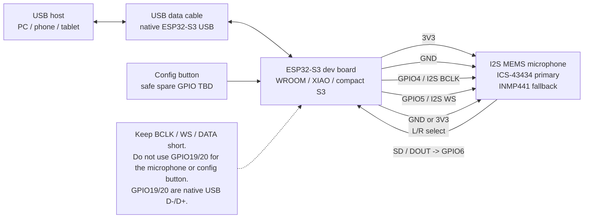
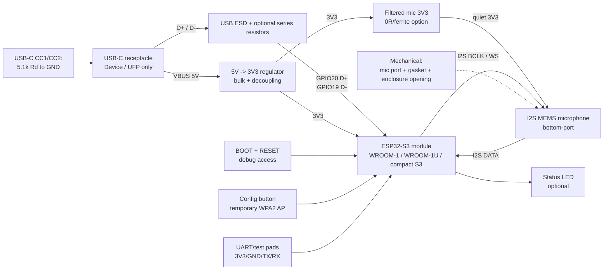

# Schematic Concept - PhonemeFree Unplugged

This document describes the first schematic direction for PhonemeFree Unplugged.

It covers two levels:

- MVP build using an ESP32-S3 development board plus an I2S microphone module.
- Future custom PCB using an ESP32-S3 module, USB-C, power regulation, protection, and a board-mounted I2S MEMS microphone.

The goal right now is not to freeze a PCB. The goal is to make the electrical shape of the project explicit before firmware work starts.

The locked v0.1 hardware target is documented in `docs/hardware/REFERENCE_BUILD_V0.1.md`.

## 1. Design Goals

The hardware must support:

- native USB Device mode for USB Audio Class microphone output;
- I2S microphone input;
- physical maintenance button for temporary configuration AP;
- stable 3.3 V power for ESP32-S3 and microphone;
- short, clean digital audio wiring;
- radio-silent-by-default operation with temporary WPA2 configuration AP;
- future migration from breadboard to perfboard to custom PCB.

Non-goals for the first schematic:

- battery charging;
- USB Power Delivery;
- analog microphone preamp;
- audio codec;
- speaker/headphone output;
- stereo microphone array;
- custom PCB production files.

## 2. MVP Breadboard / Perfboard Diagram



Equivalent source diagram: `hardware/schematic/mvp_breadboard_wiring.mmd`.

## 3. MVP Net List

Default firmware pinout:

| Net | ESP32-S3 Side | Microphone Side | Direction | Notes |
| --- | --- | --- | --- | --- |
| `+3V3` | `3V3` | `VDD` / `3V` | Power | Use the board's regulated 3.3 V output. |
| `GND` | `GND` | `GND` | Power return | Keep ground common and close to signal wiring. |
| `I2S_BCLK` | `GPIO4` | `SCK` / `BCLK` | ESP32-S3 -> mic | Default PRD pin. |
| `I2S_WS` | `GPIO5` | `WS` / `LRCLK` | ESP32-S3 -> mic | Default PRD pin. |
| `I2S_DIN` | `GPIO6` | `SD` / `DOUT` | mic -> ESP32-S3 | Default PRD pin. |
| `MIC_LR_SEL` | `GND` first | `L/R` | Static select | Start with GND; switch to 3V3 if channel selection requires it. |
| `CFG_BTN` | Safe spare GPIO TBD | Tactile button to GND | Input | Opens the temporary WPA2 maintenance AP; avoid USB, I2S, and risky boot strap pins. |
| `USB_D-` | `GPIO19` | USB connector D- | Bidirectional | Already routed on dev boards. Do not repurpose. |
| `USB_D+` | `GPIO20` | USB connector D+ | Bidirectional | Already routed on dev boards. Do not repurpose. |

## 4. Breadboard Wiring

For the first firmware bring-up:

| ESP32-S3 Dev Board | ICS/INMP441-style Module |
| --- | --- |
| `3V3` | `VDD` |
| `GND` | `GND` |
| `GPIO4` | `SCK` / `BCLK` |
| `GPIO5` | `WS` / `LRCLK` |
| `GPIO6` | `SD` / `DOUT` |
| `GND` | `L/R` |
| Safe spare GPIO TBD | Config button |
| `GND` | Config button |

Rules:

- Use the shortest jumpers you have.
- Keep `BCLK`, `WS`, and `DATA` away from loose power wires.
- Wire the config button only after selecting a safe spare GPIO for the chosen board.
- If using a breadboard, avoid running I2S signals across the whole board.
- If audio is silent, test `L/R` tied to `3V3` before changing hardware.
- If audio is unstable, move to soldered perfboard before debugging DSP.

## 5. XIAO ESP32S3 Wiring

For a compact public build:

| XIAO ESP32S3 Pin | ESP32-S3 GPIO | ICS/INMP441-style Module |
| --- | ---: | --- |
| `3V3` | 3.3 V | `VDD` |
| `GND` | GND | `GND` |
| `D3` | GPIO4 | `SCK` / `BCLK` |
| `D4` | GPIO5 | `WS` / `LRCLK` |
| `D5` | GPIO6 | `SD` / `DOUT` |
| `GND` | GND | `L/R` |

This keeps the same default firmware pinout as the full-size WROOM dev board path.

## 6. Perfboard Direction

The public DIY build should move from breadboard to double-sided 2.54 mm perfboard once the microphone produces usable samples.

Recommended physical arrangement:

```text
+-------------------------------------+
| USB-C edge of ESP32-S3 faces out    |
|                                     |
| [ ESP32-S3 board on headers/socket ]|
|                                     |
|       short underside I2S wires     |
|                                     |
| [ ICS-43434 module near board edge ]|
|   acoustic port faces outside       |
+-------------------------------------+
```

Perfboard notes:

- Socket the ESP32-S3 board if practical.
- Socket or header the microphone module so it can be replaced.
- Place the microphone at the edge of the board.
- Keep the microphone away from the USB connector and regulator area.
- Leave BOOT and RESET accessible.
- Add mechanical strain relief if the USB cable will be moved often.

## 7. Future Custom PCB Diagram



Equivalent source diagram: `hardware/schematic/future_custom_pcb_blocks.mmd`.

## 8. Future Custom PCB Blocks

### USB-C Device Input

Required:

- USB-C receptacle wired as a device/UFP.
- `CC1` to GND through 5.1 kOhm.
- `CC2` to GND through 5.1 kOhm.
- USB D- routed to ESP32-S3 `GPIO19`.
- USB D+ routed to ESP32-S3 `GPIO20`.
- Low-capacitance ESD protection near the connector.
- VBUS used as 5 V board input.

Recommended footprints:

- optional 22 ohm series resistors on D+/D-, placed close enough to be useful;
- test pads for D+ and D-;
- VBUS TVS or USB-rated ESD protection;
- optional fuse/resettable fuse on VBUS.

No USB Power Delivery controller is needed for the MVP.

### 5 V to 3.3 V Power

Required:

- 3.3 V regulator sized for ESP32-S3 Wi-Fi current peaks.
- Input and output capacitors per regulator datasheet.
- Bulk capacitance on the 3.3 V rail.
- Local decoupling near the ESP32-S3 module and microphone.

Recommended:

- regulator current capability around 700 mA or higher;
- separate filtered feed for microphone VDD using 0 ohm resistor or ferrite footprint;
- power LED with conservative current.

### ESP32-S3 Module

Preferred future PCB baseline:

- `ESP32-S3-WROOM-1-N8R8` or `ESP32-S3-WROOM-1-N16R8`.

Reasons:

- integrated RF section;
- adequate flash;
- PSRAM headroom for DSP experiments;
- easier assembly than a bare ESP32-S3 chip.

PCB rules:

- respect antenna keepout;
- expose EN/RESET and BOOT;
- expose UART0 TX/RX test pads;
- do not use flash/PSRAM-reserved pins on variants where they are unavailable;
- reserve GPIO19/20 for USB.

### I2S Microphone

Reference MVP microphone:

- ICS-43434 breakout for public MVP;
- INMP441 breakout as common fallback;
- bottom-port I2S MEMS microphone for future PCB.

Future PCB candidates:

- ICS-43434 if availability and bench results remain good;
- INMP441-style I2S microphone as fallback footprint if needed;
- TDK T5848 for a premium later revision.

Required nets:

| Net | Direction | Notes |
| --- | --- | --- |
| `MIC_3V3` | power | Ideally filtered from main 3V3. |
| `GND` | power return | Solid return path. |
| `I2S_BCLK` | ESP32-S3 -> mic | Default GPIO4 unless pinout changes. |
| `I2S_WS` | ESP32-S3 -> mic | Default GPIO5 unless pinout changes. |
| `I2S_DIN` | mic -> ESP32-S3 | Default GPIO6 unless pinout changes. |
| `MIC_LR_SEL` | static | Strap to GND or 3V3; optional 0 ohm selector footprint. |

Acoustic/layout notes:

- If the microphone is bottom-port, the PCB needs an aligned acoustic hole.
- Keep the microphone away from switching regulators, USB connector stress, and RGB/status LEDs.
- Do not route noisy clocks under the microphone package unless the mic datasheet explicitly allows it.
- Plan enclosure opening and gasket before final PCB placement.

### Debug and Recovery

Required:

- RESET/EN button or test pad.
- BOOT/GPIO0 button or test pad.
- UART TX/RX test pads.
- GND and 3V3 test pads.

Recommended:

- one status LED on a non-critical GPIO;
- silkscreen labels for boot, reset, 3V3, GND, USB D+, USB D-, I2S pins.

## 9. Net Naming Proposal

Use these names consistently in future KiCad work:

| Net Name | Purpose |
| --- | --- |
| `VBUS_5V` | USB 5 V input. |
| `+3V3` | Main regulated 3.3 V rail. |
| `MIC_3V3` | Filtered microphone 3.3 V rail. |
| `GND` | Common ground. |
| `USB_D_N` | USB D-, ESP32-S3 GPIO19. |
| `USB_D_P` | USB D+, ESP32-S3 GPIO20. |
| `I2S_BCLK` | I2S bit clock. |
| `I2S_WS` | I2S word select / LRCLK. |
| `I2S_DIN` | I2S microphone data into ESP32-S3. |
| `MIC_LR_SEL` | Microphone left/right channel select strap. |
| `ESP_EN` | ESP32-S3 enable/reset. |
| `ESP_BOOT` | ESP32-S3 boot mode input, GPIO0. |
| `UART_TXD0` | UART0 TX test pad. |
| `UART_RXD0` | UART0 RX test pad. |
| `LED_STATUS` | Optional status LED. |

## 10. Open Schematic Questions

These should be resolved before a real KiCad schematic:

- Which exact ESP32-S3 board/module becomes the public reference build?
- Does the firmware keep GPIO4/5/6 forever or expose alternate pin profiles?
- Which microphone has the best availability/quality tradeoff after real audio tests?
- Which GPIO should the physical configuration AP button use without touching USB pins, I2S pins, or risky boot straps?
- Should the custom PCB include a separate physical bypass button?
- Should the custom PCB include a mute/privacy switch that cuts microphone data or power?
- Should the device expose UART pads only, or include a USB-UART bridge?
- Is the final enclosure USB dongle-sized, small box-sized, or wearable-sized?

## 11. First Build Recommendation

Do not start KiCad yet.

Recommended order:

1. Build the breadboard wiring exactly as shown.
2. Confirm I2S clock/data activity.
3. Confirm USB enumeration from firmware.
4. Move the same circuit to double-sided perfboard.
5. Run longer stability tests.
6. Only then move KiCad schematic and PCB layout into the v0.2 hardware track.

This keeps the electronics honest while the firmware is still moving.
